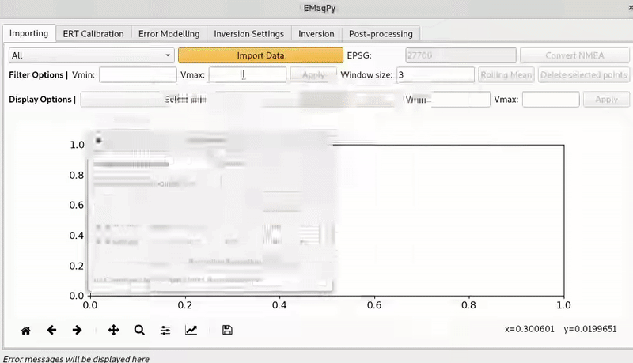

# EMagPy

Python API for inversion/modelling of frequency domain electromagnetic data (FDEM).

EMagPy is divided into a Python API and a standalone graphical user interface (GUI).
It aims to be a powerfull but simple tool for inverting EMI data obtain from conductimeters.
EMagPy documentation can be viewed at https://hkex.gitlab.io/emagpy. Please also check the FAQ below.

# Graphical User Interface (GUI)



# Getting started
Clone the repository:
```sh
git clone https://gitlab.com/hkex/emagpy
```
Change to the `src` directory and run `ui.py` to start the GUI.
```sh
cd emgapy/src
python ui.py # this will start the GUI
```
The python API is available by simply importing the `emagpy` module from the python shell:
```python
import emagpy
k = Problem()
k.createSurvey('./test/coverCrop.csv')
k.invert(forwardModel='CS') # specify the forward model (here the Cumulative Sensitivty of McNeil1980)
k.showResults() # display the section
k.showMisfit() # display predicted and observed apparent EC
k.showOne2one() # 1:1 line of misfit of apparent EC
```

For more example, check out the [jupyter-notebook](jupyter notebooks).


Downloads
---------
as a self-extractable executable:

[](https://github.com/hkexgroup/emagpy/releases/download/v1.1.0/EMagPy-windows.exe)
[](https://github.com/hkexgroup/emagpy/releases/download/v1.1.0/EMagPy-macos.dmg)
[](https://github.com/hkexgroup/emagpy/releases/download/v1.1.0/EMagPy-linux)

as a zip file:

[](https://github.com/hkexgroup/emagpy/releases/download/v1.1.0/EMagPy-windows.zip)
[](https://github.com/hkexgroup/emagpy/releases/download/v1.1.0/EMagPy-macos.zip)
[](https://github.com/hkexgroup/emagpy/releases/download/v1.1.0/EMagPy-linux.zip)


Citing EMagPy
-------------
If you use EMagPy for you work, please cite [this paper](https://doi.org/10.1016/j.cageo.2020.104561) as:

    McLachlan, Paul, Guillaume Blanchy, and Andrew Binley. 2020. 
    ‘EMagPy: Open-Source Standalone Software for Processing, Forward Modeling 
    and Inversion of Electromagnetic Induction Data’.
    Computers & Geosciences, August, 104561. https://doi.org/10.1016/j.cageo.2020.104561.

BibTex code:
```latex
@article{mclachlan_emagpy_2020,
	title = {{EMagPy}: open-source standalone software for processing, forward modeling and inversion of electromagnetic induction data},
	issn = {0098-3004},
	shorttitle = {{EMagPy}},
	url = {http://www.sciencedirect.com/science/article/pii/S0098300420305513},
	doi = {10.1016/j.cageo.2020.104561},
	language = {en},
	urldate = {2020-08-30},
	journal = {Computers \& Geosciences},
	author = {McLachlan, Paul and Blanchy, Guillaume and Binley, Andrew},
	month = aug,
	year = {2020},
	pages = {104561}
}
```

Frequently Asked Question (FAQ)
-------------------------------

### How to format the input files?

EMagPy requires input file to be formated as .csv with one header row. Headers include `x`, `y` and `elevation` for the locations. Other headers are formatted as
 `<coilOrientation><coilSpacing>f<frequency>h<heightAboveGround><suffix>`.
e.g.: VCP0.32f30000h1 means the coils are in vertical coplanar (VCP) orientation, spaced by 0.32 meters, operated at a frequency of 300000 Hz and are at 1 meter above the ground surface.

With:

* `<coilOrientation>` could be: VCP (=HMD), HCP (=VMD) or PRP
* `<coilSpacing>` is the distance between the transmitter coil and the receiving coil expressed in meters
* `<frequency>` is th operating frequency in Hz
* `<heightaboveGround>` is the height at which the device was operated above the surface in meters
* `<suffix>` is optional and be set to `_inph` for inphase value in ppt or `_quad` for quadrature value in ppt

example: 
| x | y | elevation | VCP0.71 | VCP1.18 |
|---|---|-----------|---------|---------|
| 0 | 0 | 0         | 34.67   | 38.32   |
| 1 | 0 | 0         | 36.69   | 40.16   |
| 2 | 0 | 0         | 35.79   | 39.21   |


### What is ERT calibration and do I need it?

Electrical Resistivity Tomography (ERT) is an electrical method that measure the ground resistivity using electrodes in contact with the subsurface. Given its larger number of measurements compared to FDEM, it usually gives a better representation of the subsurface. FDEM instruments usually provide qualitative values. In order to convert these qualitative value to *quantitative values*, co-located ERT and FDEM measurement can be taken. FDEM measurements are then calibrated according to the ERT data.


### When to convert to LIN ECa?

To the best of our knowledge, this is specific to *GF-Instruments* (CMD Mini-Explorer, CMD Explorer). GF Instruments used a custom linear relationship to convert quadrature values to ECa (F-Ground, F-0m or F-1m) while other instruments usually rely on the Low Induction Number (LIN) approximation (McNeil, 1980). For 'F-1m' for instance, the ECa values displayed by the GF instruments are gained by this relationship to appear closer to the actual ground EC. However, this relationship comes in the way for proper inversion as it is not physically based (while LIN is). It is then recommended that if the data comes from a GF-Instruments, such conversion is applied. While this correction has minimal effect on the F-Ground and F-0m calibrations, it has big implication for the F-1m of the CMD Explorer. More information is provided in the EMagPy paper. 


Older versions
--------------
v 1.0.0

[](https://github.com/hkexgroup/emagpy/releases/download/v1.0.0/EMagPy-windows.exe)
[](https://github.com/hkexgroup/emagpy/releases/download/v1.0.0/EMagPy-macos.dmg)
[](https://github.com/hkexgroup/emagpy/releases/download/v1.0.0/EMagPy-linux)

[](https://github.com/hkexgroup/emagpy/releases/download/v1.0.0/EMagPy-windows.zip)
[](https://github.com/hkexgroup/emagpy/releases/download/v1.0.0/EMagPy-macos.app.zip)
[](https://github.com/hkexgroup/emagpy/releases/download/v1.0.0/EMagPy-linux.zip)


[](https://gitlab.com/hkex/emagpy/-/commits/master)

(alpha) EMagPy online based on Voila: replace `tree` with `voila/tree` once the binder url is loaded, then load `ui.ipynb`.
