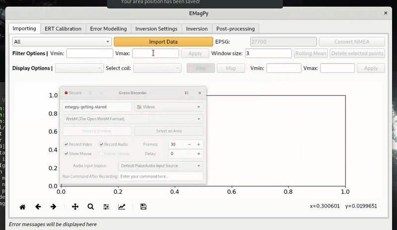

Getting Started
===============

EMagPy aims to process frequency domain electromagnetic measurements (FDEM) taken with electromagnetic induction (EMI) device. EMagPy has a python application programming interface (API) to use in Jupyter-notebook (see section Examples) and a standalone graphical user interface (GUI).

.. _guiGif:

    
    Animation of the workflow of inverting EMI data with the `coverCrop.csv` dataset in the GUI.

The same processing can be achieved with the python API::

    from emagpy import Problem
    k = Problem()
    k.createSurvey('test/coverCrop.csv')
    k.invert() # invert measurements
    k.showResults() # display inverted pseudo-section

More examples are available in the Example pseudo-section.

