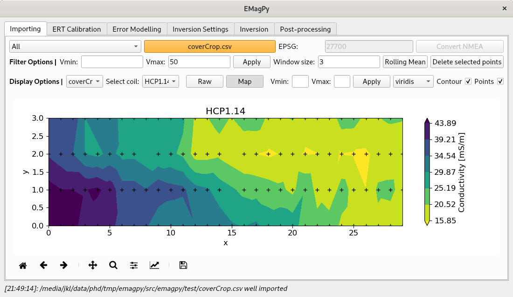
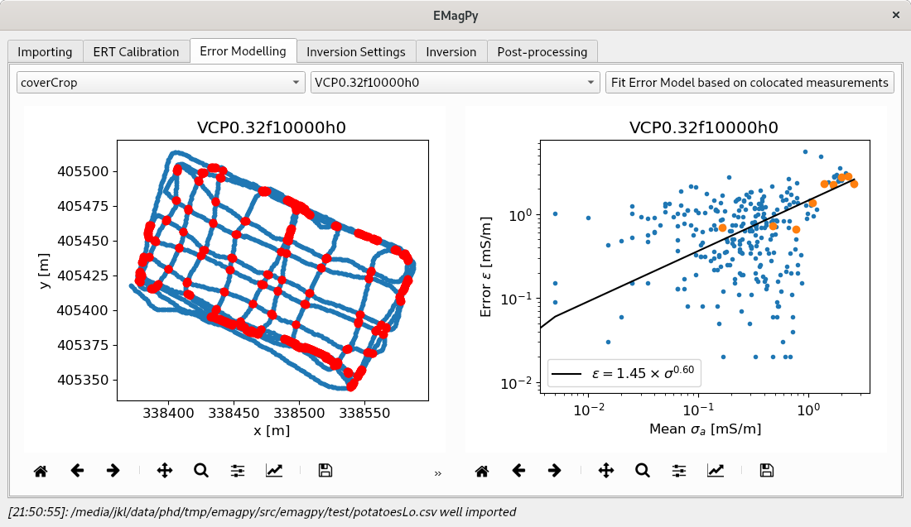
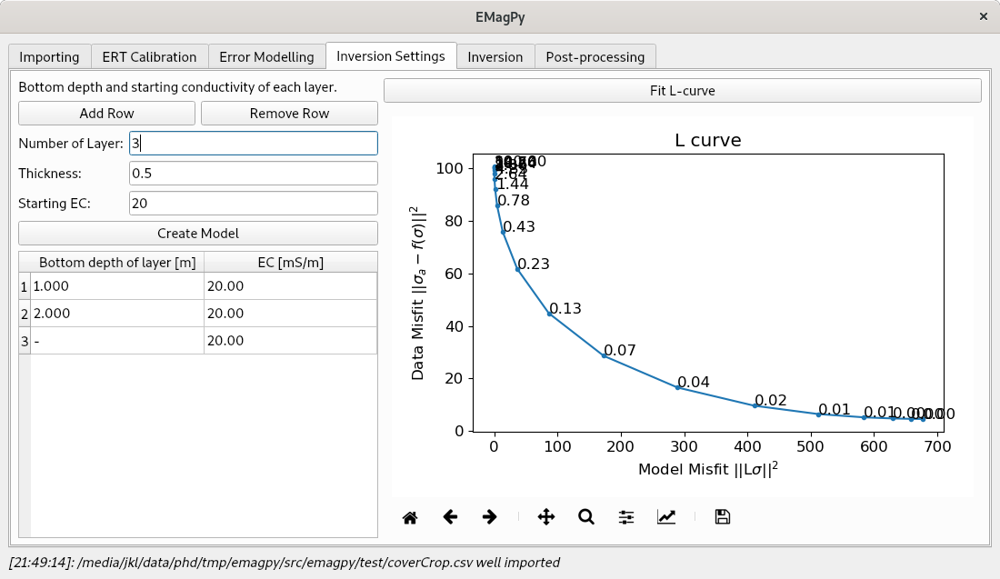
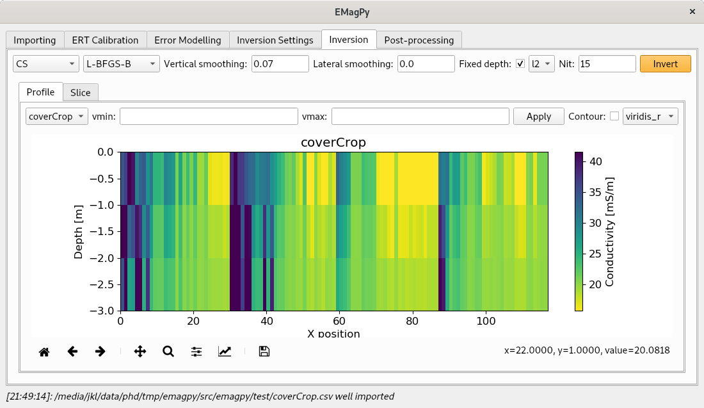
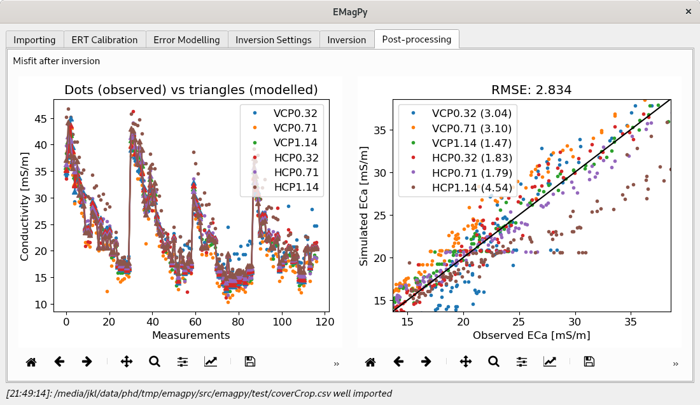

Graphical User Interface
========================
The Graphical User Interface (GUI) is composed of differents tabs.

.. _importing:
.. figure:: image/importing.png
    :alt: importing tab
    
    Importing tab with the `coverCrop.csv` dataset. Filtering options are availables.

.. _importingMap:

    
    The dataset can also be viewed as a contour map if spatial data available.
    

In :numref:`importing` we can see the general tabbed interface with the `coverCrop.csv` dataset imported. The :numref:`importingMap` show the same dataset but plotted as a contour map.    

.. _errorModelling:

    
    An error model from cross-over points can be fitted if the survey contains spatial coordinates.
    
.. _inversionSettings:

    Inversion settings tab where the number of layer and the starting EC can be defined. An L-curve can also be fitted to give indication about the best damping factor.
    
.. _inversion:

    Inversion tab where different inversion parameters can be chosen such as: the forward model, the number of iteration, the damping factor for vertical and horitontal smoothing. The inverted section can be seen as a profile or as map.
    
.. _postProcessing:

    The post-processing tab contains two graphs showing the misfit (on the left) between the observed ECa and the simulated ECa. The right graph is a 1:1 graph between the two.

